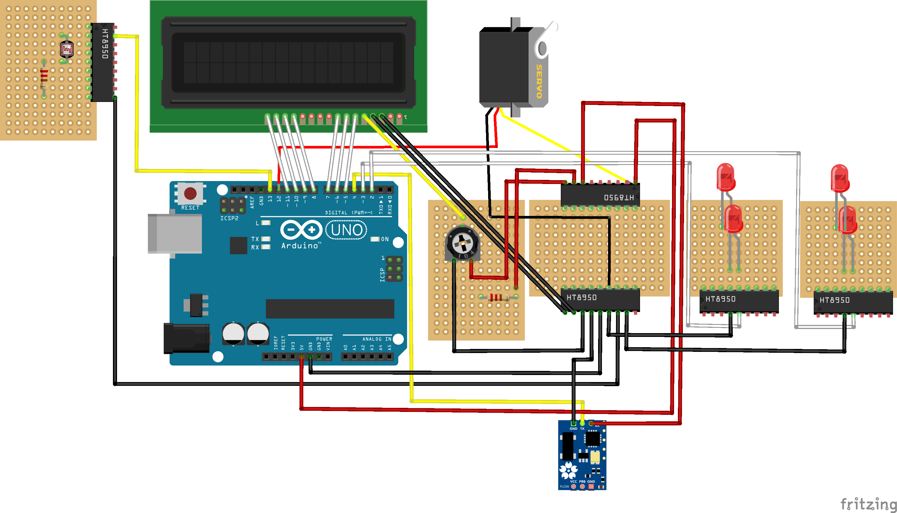
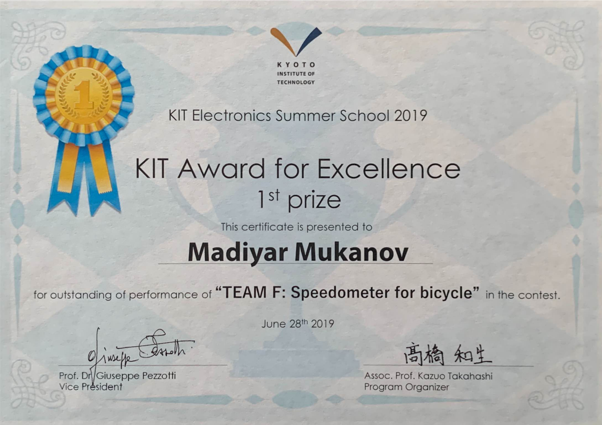

# Arduino Bicycle Speedometer — Kyoto Award 2019

**One-liner.** LCD speed & trip distance (0–45 km/h), analog **servo** needle, **Hall** pulses, and **LDR/CDS**-based night LEDs for safer cycling. Awarded *Excellence in Electronics* (Kyoto, 2019).

> Demo ↓ (GIF / MP4)
>
> 
>
> [▶ Full demo video (MP4)](media/demo.mp4)

---

## Features
- **Live speed** (km/h) and **trip distance** (km) on a 16×2 I²C LCD.
- **Analog needle**: servo angle linearly maps to speed (0–45 km/h).
- **Night mode**: when ambient light drops below a threshold (LDR/CDS), **front** and **rear** LEDs turn on automatically.
- **Simple build**: reproducible wiring; wheel circumference is fully configurable.

---

## Hardware (BOM)
- **MCU:** Arduino **Uno** or **Nano** (Nano recommended for compact installs).
- **Speed sensing:** Hall-effect sensor (e.g., **A3144**) + **neodymium spoke magnet**.
- **Display:** **16×2 LCD** with I²C backpack (PCF8574).
- **Servo:** **SG90** (9 g).
- **Lighting:** 2× LEDs (white = front, red = rear) + **220–330 Ω** series resistors.
- **Ambient light:** LDR/CDS + **10 kΩ** resistor (voltage divider).
- **Power:** regulated **5 V** (buck from Li-ion 18650 / power bank) or 4×AA via a 5 V regulator.
- **Misc:** hookup wire, heat-shrink, zip ties, 3M pads/brackets for the sensor and magnet.

> *Optional:* driver transistors or a dedicated LED module for brighter headlights; EEPROM buttons for on-bike wheel calibration.

---

## Wiring / Schematic

**Fritzing files**
- PNG: `hardware/fritzing/diagram.png`  
- Source: `hardware/fritzing/diagram.fzz`

**Default pinout (Arduino Uno/Nano):**

| Module               | Arduino Pin         | Notes                                                 |
|---                   |---                  |---                                                    |
| Hall sensor (A3144)  | **D2 (INT0)**       | Interrupt on edge; use `INPUT_PULLUP`.                |
| Servo SG90           | **D9 (PWM)**        | Power from 5 V; share common GND.                     |
| LCD 16×2 (I²C)       | **SDA=A4**, **SCL=A5** | Typical I²C address `0x27` or `0x3F`.              |
| LDR (divider)        | **A0**              | Second leg: **10 kΩ** to GND.                         |
| Front LED            | **D3 (PWM)**        | **220–330 Ω** in series with the anode.               |
| Rear LED             | **D5 (PWM)**        | **220–330 Ω** in series with the anode.               |

> Pins are configurable in the sketch’s config block.

---

## How it works (math)
- Wheel circumference: `C = π · D` (meters).  
  Example: 700×25C → **2.096 m** (≈ **2096 mm**).
- Hall pulses: **1 magnet = 1 pulse = 1 revolution** (or set `PULSES_PER_REV` if different).
- Speed:  
  `speed_kmh = (pulses_per_second / PULSES_PER_REV) * C_m * 3.6`
- Trip distance:  
  `trip_km += (pulses * C_m) / 1000`

---

## Firmware

### Dependencies
- Arduino IDE **1.8+** or **2.x**
- Libraries:
  - `LiquidCrystal_I2C` (any compatible fork)
  - `Servo` (built-in)
  - *(optional)* `EEPROM` for persisting calibration

## Certificate — Kyoto 2019

**Award:** Excellence in Electronics, KIT Summer School (Kyoto, 2019)

  
   
  Click the image for the full-resolution PDF

